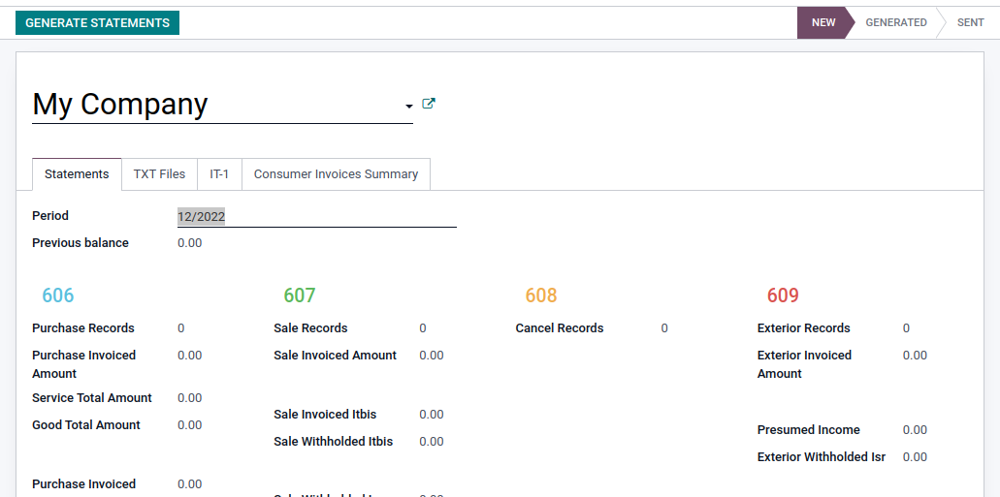
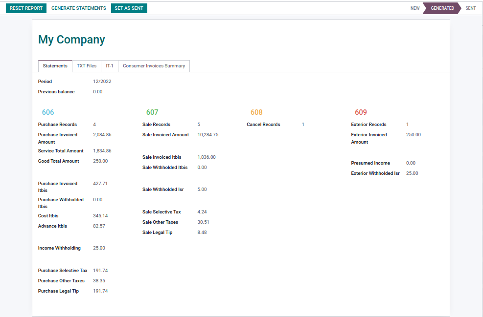
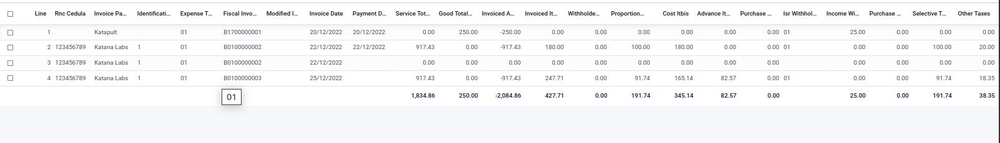
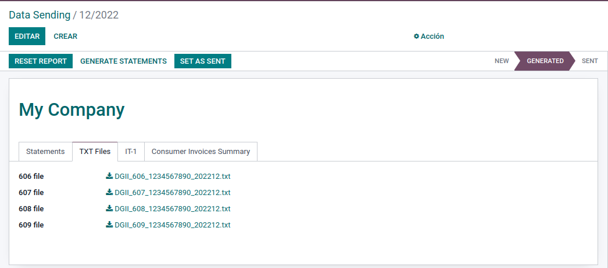
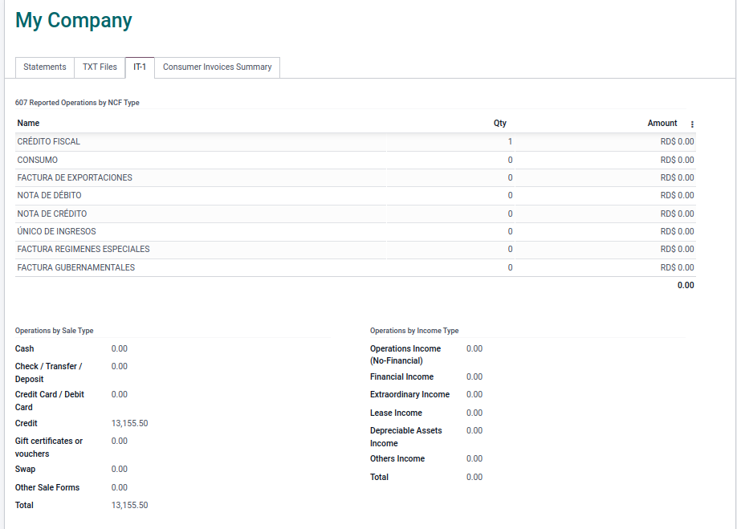
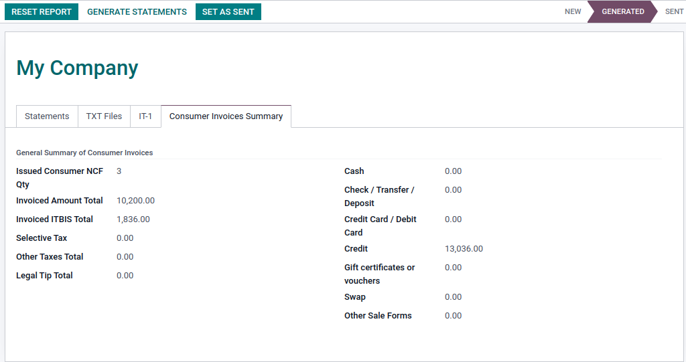
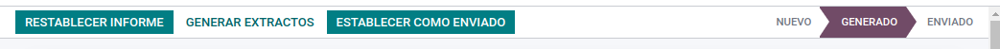

# Reportes DGII
Este es el repositorio de los módulos de generación automática de reportes para la ***Dirección General de Impuestos Internos (DGII)*** en República Dominicana.

El modulo utilizado en esta version:

**kl_dgii_report**: Este módulo agrega funcionalidades para poder generar los reportes a la DGII.

    - 606: Compras de bienes y servicios
    - 607: Ventas de bienes y servicios
    - 608: Comprobantes anulados o cancelados
    - 609: Pagos al exterior
    - IT-1: Informe de bienes y servicios vendidos y comprados
    - IR-17 (Pronto)
    - IR-3 (Pronto)
    - IR-2 (Pronto)
    

## Configuración

**Configuración Basica para poder generar los reportes de DGII**:

    1- Ir a Configuracion 
    2- Activar Modo desarrollador 
    3- Usurios y compañia 
    4- Grupos 
    5- Contabilidad / Mostrar características de contabilidad completas 
    6- Agregar el usuario al grupo 
    7- Guardar y salir 
    8- Entrar al modulo de Contabilidad 
    9- Menú Contabilidad 
    10- Dgii / Data Sending 
    11- Luego crear un reporte con el periodo (Mes / Año) 
    12- Generar statements

 **Configuración de Plan de Cuentas**:

    1- En el modulo de Contabilidad 
    2- Menú Configuración 
    3- Contabilidad / Plan de Cuentas 
    4- Seleccionar una cuenta 
    5- Ir a Configurar 
    6- Agregar el tipo de cuenta fiscal correspondiente a la cuenta, si es necesario.

**Configuración de Diarios de pagos**:

    1- En el modulo de Contabilidad 
    2- Menú Configuración 
    3- Contabilidad / Diarios Contables 
    4- Entrar a un diario de pago 
    5- Agregarle la Forma de pago correspondiente al tipo de diario.

## ¿Que hace el Modulo?

Este módulo agrega una pestaña en la vista de formulario de la factura, llamado **DGII**, donde se ve un desglose de la información relevante de esta factura para el reporte 606, 607 o IT-1. En esta sección también se encuentra el estado de la inclución de dicha factura a algún reporte y si este ha sido enviado o no.

Además, visualice el ITBIS por adelantar (o adelantado), otros impuestos, ITBIS retenido y el tipo de retención y se visualizan de la siguiente manera:

**Facturas de Compras de bienes y servicios (606)**
    
        Retenciones de Impuestos:
            - Tipo de Retencion de ISR
            - Retencion de ITBIS
            - Retencion de ingresos
        
        Impuestos
            - ITBIS Facturado
            - Impuesto Selectivo
            - Otros Impuestos
            - Monto de propila legal
            - Impuesto de Proporcionalidad
            - Costo de ITBIS
            - ITBIS Advanzado

        Facturación
            - Fecha de pago
            - Forma de Pago
            - Monto Total de Servicios
            - Monto Total de Bienes

        606
            - Estado Fiscal

**Facturas de Ventas de bienes y servicios (607)**

        Retenciones de Impuestos:
            - Fecha de Retencion 
            - Retencion de ITBIS por terceros
            - Retencion de ingresos por terceros
        
        Impuestos
            - ITBIS Facturado
            - Impuesto Selectivo
            - Otros Impuestos
            - Monto de propila legal
        
        607
            -Estado Fiscal

Agrega sub menú dentro del menú de contabilidad, llamado **DGII Report**, donde se podran crear y ver reportes **606,607,608 y 609** con el total de todas las facturas dentro del periodo.

Para crear los reportes solo tiene que agregar la **fecha del periodo** y darle al boton verde **Generate extractos**.

Una vez todo creado, debe verse así.

Con el Total de todas las facturas y sus informaciones correspondiente al periodo establecido.

Al hacer click en el numero de uno de los reportes, se verá una lista en detalle de cada una de las facturas, que pertenecen a ese reporte.

En la pestaña **Archivo txt** se vera el link para descargar los diferentes reportes en un archivo de texto, con toda la informacion del reporte y para que pueda llenar facilmente los formatos de envio de DGII.

En la pestaña **IT-1** Se verá los resultados de las ventas y compras de vienes y servicios.

En la Pestaña **Resumen de facturas al consumidor** se encuentra en detalle el resultado de todas las facturas de consumo.

Para volver a generar los reportes solo tiene que darle al boton **Generar Extractos** y luego **Regenerar**

Para indicar los reportes como enviado solo tiene que darle al boton **Establecer como Enviado**

Para volver los reportes al estado nuevo y modifarlos, puede darle al boton **Restablecer Informe**

## Créditos
Este trabajo tuvo su origen en manos de:
- Eneldo Serrata (marcos.do)
- Gustavo Valverde (iterativo.do)
- José López (indexa.do)

Gracias ;-)